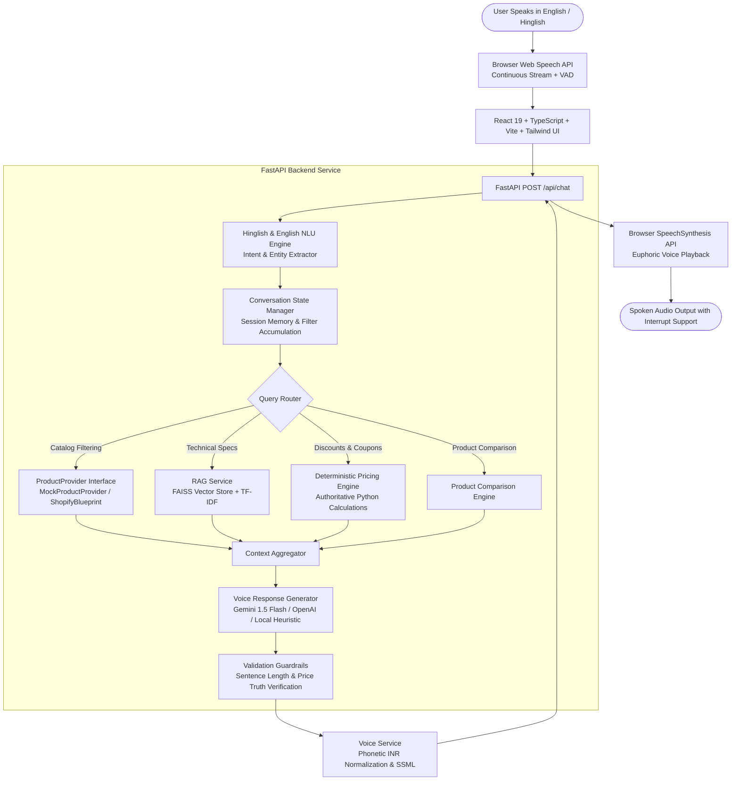

<div align="center">

# 🎙️ VaaniCart AI (वाणीकार्ट)
### *Next-Generation Full-Stack Voice AI Shopping Assistant for Indian E-Commerce*

> **"Your AI Shopping Assistant — Just Ask."**

[](https://www.python.org/)
[](https://fastapi.tiangolo.com/)
[](https://react.dev/)
[](https://vitejs.dev/)
[](https://tailwindcss.com/)
[](https://github.com/facebookresearch/faiss)
[](https://ai.google.dev/)
[](backend/tests)
[](LICENSE)

---

**VaaniCart AI** is a production-quality full-stack Voice Commerce assistant built to demonstrate merchant-facing Voice AI capabilities. It enables natural multi-turn voice shopping in **English** and **Hinglish**, featuring real-time Speech-to-Text (STT), deterministic backend pricing calculations, FAISS vector store RAG, guardrail validation, and euphonic Text-to-Speech (TTS) with speech interruption.

</div>

---

## 📑 Table of Contents

- [System Architecture](#-system-architecture)
- [Key Capabilities](#-key-capabilities)
- [Voice Interaction Pipeline](#-voice-interaction-pipeline)
- [Hinglish & Natural Language Understanding](#-hinglish--natural-language-understanding)
- [Deterministic Pricing Engine](#-deterministic-pricing-engine)
- [FAISS Vector Store RAG Retrieval](#-faiss-vector-store-rag-retrieval)
- [Product Catalog](#-product-catalog)
- [Shopify-Ready Abstraction](#-shopify-ready-abstraction)
- [Project Directory Structure](#-project-directory-structure)
- [Getting Started](#-getting-started)
- [REST API Reference](#-rest-api-reference)
- [Automated Testing Suite (23 Tests)](#-automated-testing-suite-23-tests)
- [Manual Voice AI Test Checklist](#-manual-voice-ai-test-checklist)
- [Deployment Guide](#-deployment-guide)

---

## 🏗️ System Architecture



---

## ✨ Key Capabilities

1. **Genuine Voice-First Experience**:
   - Central animated microphone button with states: `IDLE`, `LISTENING`, `PROCESSING`, `SPEAKING`, `ERROR`.
   - Continuous speech recognition with **Voice Activity & Silence Detection (1.6s timeout)** so you are never cut off mid-sentence.
   - Dedicated **"Done Speaking (Send Now)"** button for instant manual submission.
   - Immediate **Audio Interruption**: tapping the mic or clicking "Stop Spoken Audio" halts speech output instantly.
2. **Native Hinglish Support**:
   - Seamlessly understands natural Indian shopping idioms (*"Running shoes dikhao under 3000"*, *"Mujhe black sneakers chahiye"*, *"Iska discount kitna hai?"*, *"Ye shoes size 9 mein available hai kya?"*).
   - Preserves user conversational tone without forced translation into formal English.
   - Dialect switcher in header: toggle between `🇮🇳 Hinglish / English (en-IN)` and `🇮🇳 Hindi (hi-IN)`.
3. **Deterministic Backend Pricing Engine (No LLM Math)**:
   - **Zero LLM Price Hallucination**: base prices, MRP discounts, coupons (`VAANI100`, `FESTIVE20`, `WELCOME50`), and GST are computed authoritatively in pure Python backend logic.
4. **FAISS Vector Store RAG Retrieval**:
   - Technical specifications, dimensions, battery life, and materials are chunked and indexed into FAISS (`IndexFlatIP`).
   - Answers questions like *"Which headphones have noise cancellation?"* or *"Which laptop has the best battery life?"* strictly using catalog ground truth.
5. **Multi-Turn Conversational Memory**:
   - Retains context across turns (e.g. Turn 1: *"Mujhe running shoes chahiye"* $\rightarrow$ Turn 2: *"Under 3000"* $\rightarrow$ Turn 3: *"Iska discount kitna hai?"* retains the active product).
6. **Observability & Developer Inspector**:
   - Real-time collapsible dev drawer showing detected intent, extracted entities, latency breakdown (intent, retrieval, pricing, LLM, validation, total), authoritative pricing data, RAG sources, and active prompt versions.
7. **Production-Ready & Shopify-Abstracted**:
   - Clean `ProductProvider` interface ready to swap `MockProductProvider` for `ShopifyProductProvider` via Shopify Storefront GraphQL API.

---

## 🎙️ Voice Interaction Pipeline

### 1. Continuous Speech Recognition & VAD
The frontend uses the Web Speech API with `continuous = true`. To solve the classic issue of voice assistants cutting users off when taking a breath, VaaniCart AI implements an intelligent **Silence Debounce Detector**:
- Captures live audio stream and displays interim words in real time.
- Resets a 1.6-second timer whenever the user speaks.
- Only finalizes and dispatches the query once the user has stopped speaking for a full 1.6 seconds, or if the user clicks "Done Speaking".

### 2. Spoken Audio Normalization
Before the text is fed to Text-to-Speech (TTS):
- Formats Indian Rupee values: `₹2,499` $\rightarrow$ *"2,499 rupees"*.
- Expands technical acronyms for natural phonetic pronunciation:
  - `ANC` $\rightarrow$ *"Active Noise Cancellation"*
  - `TWS` $\rightarrow$ *"True Wireless"*
  - `GaN` $\rightarrow$ *"Gallium Nitride"*
  - `AMOLED` $\rightarrow$ *"Am-o-led"*
- Enforces a 2–4 sentence brevity rule, stripping bullet points and URLs.

---

## 🗣️ Hinglish & Natural Language Understanding

VaaniCart AI natively understands both English and colloquial Roman-script Hindi (Hinglish):

| User Spoken Query | Detected Intent | Extracted Entities |
|---|---|---|
| *"Running shoes dikhao under 3000"* | `product_search` | Category: `Running Shoes`, Max Price: `₹3,000` |
| *"Mujhe black sneakers chahiye"* | `product_search` | Category: `Sneakers`, Color: `Black` |
| *"Iska discount kitna hai?"* | `discount_query` | Refers to `current_product_context` |
| *"Ye shoes size 9 mein available hai kya?"* | `availability_query` | Size: `9`, checks active product stock |
| *"Budget 2500 hai, kuch achha suggest karo"* | `product_recommendation` | Max Price: `₹2,500`, Min Rating: `4.2` |
| *"Compare Sprint X and Runner Pro"* | `product_comparison` | Targets: `[shoe_001, shoe_002]` |
| *"Which headphones have noise cancellation?"* | `product_details` (RAG) | FAISS retrieval for `ANC` / `Noise Cancellation` |

---

## 💰 Deterministic Pricing Engine

The LLM is **never allowed** to calculate authoritative prices or discounts. All math is performed deterministically in `app/services/pricing_service.py`:

```python
original_mrp = product.original_price
base_price = product.price
unit_discount_amount = max(0, original_mrp - base_price)
unit_discount_percentage = int(round((unit_discount_amount / original_mrp) * 100))
final_payable = max(0, (base_price * quantity) - coupon_discount)
```

### Active Coupon Codes
- **`VAANI100`**: Flat ₹100 OFF on orders $\ge$ ₹999.
- **`FESTIVE20`**: 20% OFF up to ₹500 on orders $\ge$ ₹1,499.
- **`WELCOME50`**: Flat ₹50 OFF on orders $\ge$ ₹499.

---

## 🔍 FAISS Vector Store RAG Retrieval

Product descriptions, technical specifications, and key features are chunked into semantic passages on startup and embedded using L2-normalized vector embeddings into FAISS (`IndexFlatIP`):

```python
# Chunk creation for semantic vector indexing
chunk_feat = f"Product {p.name} Specifications: {'; '.join(p.features)}. Colors: {p.color}. Sizes: {p.sizes}."
faiss.normalize_L2(tfidf_matrix)
index = faiss.IndexFlatIP(dim)
index.add(tfidf_matrix)
```

When answering queries about specific attributes (e.g. *"Which laptop has the best battery life?"* or *"Are there waterproof backpacks?"*), the RAG pipeline retrieves the top-4 chunks and injects strictly verified context into the LLM prompt.

---

## 📦 Product Catalog

The seed catalog in `backend/app/data/products.json` contains **42+ realistic products** across 8 Indian e-commerce categories:

1. **Running Shoes**: Sprint X, Runner Pro Cloud Stride, Pace Aero Reflex, Marathon Elite Carbon, TrailGrip 4X, LiteFlow Slip-On
2. **Sneakers**: Urban Retro Classic Low, Shadow Stealth Mid-Top, Chunky Glide Dad Sneaker, Pulse High Canvas, Solar Wave
3. **Headphones**: AcousticPro 800 Hybrid ANC, BassMaster Studio 500, SonicAir ANC Earbuds, EchoPulse, AeroBeats Gaming
4. **Smart Watches**: Chronos Pulse AMOLED, FitTrack Elite GPS, Aura Luxe Metal Mesh, Verve Neo Band, Titanium Explorer
5. **Backpacks**: TrailBlazer 35L Rucksack, CommuteShield Anti-Theft, Metro Slim Brief-Pack, CampMaster 55L, Campus Classic
6. **T-Shirts**: Breeze Supima Cotton, AeroDry Performance, Vintage Heavyweight Graphic, Luxe Pique Polo, Tri-Blend Gym Tank
7. **Laptops**: AeroBook Ultra 14 OLED, TitanForge 15 Gaming RTX 4060, Nova Air 13, IdeaPro 15, FlexBook 360 2-in-1
8. **Mobile Accessories**: MagGrip 10k PowerBank, 65W GaN III Fast Charger, ArmorFlex 100W Cable, AutoGrip Car Mount, GripShield Case, 7-in-1 USB-C Hub

---

## 🔌 Shopify-Ready Abstraction

To support switching from mock seed data to a live Shopify store without modifying any conversational or shopping logic:

- **`ProductProvider`** (`backend/app/services/providers/product_provider.py`): Abstract Base Class declaring `search()`, `get_by_id()`, `get_by_ids()`, `get_categories()`, `get_all()`.
- **`MockProductProvider`**: Current implementation serving the rich in-memory catalog.
- **`ShopifyProductProvider`** (`backend/app/services/providers/shopify_provider.py`): Production blueprint using Shopify Storefront GraphQL queries to map Shopify products, variants, and metafields to internal models.

To switch to Shopify in production:
```env
PRODUCT_PROVIDER=shopify
SHOPIFY_STORE_DOMAIN=your-store.myshopify.com
SHOPIFY_STOREFRONT_ACCESS_TOKEN=shpat_xxxxxxxxxxxxxxxx
```

---

## 📁 Project Directory Structure

```
vaanicart-ai-voice-agent/
├── backend/
│   ├── app/
│   │   ├── main.py                  # FastAPI application entry point & lifecycle
│   │   ├── api/routes/
│   │   │   ├── chat.py              # Master voice pipeline endpoint (/api/chat)
│   │   │   ├── products.py          # Product search and details
│   │   │   ├── pricing.py           # Deterministic price & coupon calculation
│   │   │   ├── compare.py           # Product comparison matrix
│   │   │   ├── recommend.py         # Recommendation engine
│   │   │   ├── rag.py               # Direct semantic RAG retrieval
│   │   │   ├── conversation.py      # Multi-turn session state API
│   │   │   └── health.py            # Health check endpoint (/health)
│   │   ├── core/config.py           # Pydantic Settings (.env configuration)
│   │   ├── data/products.json       # 42+ realistic products seed data
│   │   ├── models/                  # Pydantic models (Product, Conversation)
│   │   ├── schemas/                 # Request & Response API schemas
│   │   ├── prompts/                 # Versioned prompt templates (v1, v2)
│   │   ├── services/
│   │   │   ├── llm_service.py       # Gemini API / OpenAI API / Local Agent
│   │   │   ├── rag_service.py       # FAISS vector store & semantic chunk index
│   │   │   ├── pricing_service.py   # Deterministic authorative pricing
│   │   │   ├── product_service.py   # Provider orchestration
│   │   │   ├── prompt_service.py    # Versioned prompt loader
│   │   │   ├── validation_service.py# Response guardrails & price verifier
│   │   │   ├── voice_service.py     # Phonetic INR and SSML formatter
│   │   │   └── conversation_service.py # Session state manager
│   │   ├── services/providers/      # ProductProvider ABC, Mock & Shopify
│   │   └── utils/language.py        # Hinglish/English NLU parser & regex
│   ├── tests/                       # 23 automated pytest tests
│   ├── requirements.txt             # Python dependencies
│   └── .env.example                 # Backend environment template
├── frontend/
│   ├── src/
│   │   ├── components/
│   │   │   ├── VoiceButton.tsx      # Central animated microphone button
│   │   │   ├── TranscriptPanel.tsx  # Live speech-to-text transcript panel
│   │   │   ├── ProductCard.tsx      # Product card with badges & action triggers
│   │   │   ├── ProductGrid.tsx      # Responsive product grid with category pills
│   │   │   ├── ComparisonPanel.tsx  # Side-by-side comparison modal with TTS
│   │   │   ├── ProductDetailsModal.tsx # Full specs & live coupon tester
│   │   │   ├── ChatMessage.tsx      # Conversation chat stream with replay
│   │   │   ├── DebugPanel.tsx       # Collapsible developer observability drawer
│   │   │   └── DemoChips.tsx        # One-tap demo voice prompt chips
│   │   ├── hooks/
│   │   │   ├── useVoice.ts          # Web Speech STT, VAD silence timer & TTS
│   │   │   └── useConversation.ts   # Chat memory & catalog state manager
│   │   ├── services/api.ts          # Typed REST API client
│   │   ├── types/                   # TypeScript models & interfaces
│   │   ├── App.tsx                  # Main voice shopping interface
│   │   └── index.css                # Tailwind CSS v4 & custom wave animations
│   ├── package.json
│   └── vite.config.ts
├── README.md
└── .gitignore
```

---

## 🚀 Getting Started

### Prerequisites
- **Node.js** v18+ & **npm**
- **Python** 3.11+

### 1. Clone the Repository
```bash
git clone https://github.com/RahulK512005/vaanicard-ai-voice-agent.git
cd vaanicard-ai-voice-agent
```

### 2. Backend Setup
```bash
cd backend

# Create and activate virtual environment (optional)
# python -m venv venv
# source venv/bin/activate  # On Windows: .\venv\Scripts\Activate.ps1

# Install dependencies
pip install -r requirements.txt

# Configure environment variables
cp .env.example .env

# Run FastAPI backend server
# On Windows PowerShell:
$env:PYTHONPATH="."
python -m uvicorn app.main:app --host 127.0.0.1 --port 8000 --reload
```

- **Backend API**: `http://127.0.0.1:8000`
- **Interactive OpenAPI Docs**: `http://127.0.0.1:8000/docs`
- **Health Check**: `http://127.0.0.1:8000/health`

### 3. Frontend Setup
In a separate terminal:
```bash
cd frontend

# Install dependencies
npm install

# Start Vite dev server
npm run dev -- --host 127.0.0.1 --port 5173
```

- **Frontend Application**: **`http://127.0.0.1:5173/`**

---

<div align="center" >
Built with ❤️ for Indian Voice Commerce • **VaaniCart AI**

</div>
