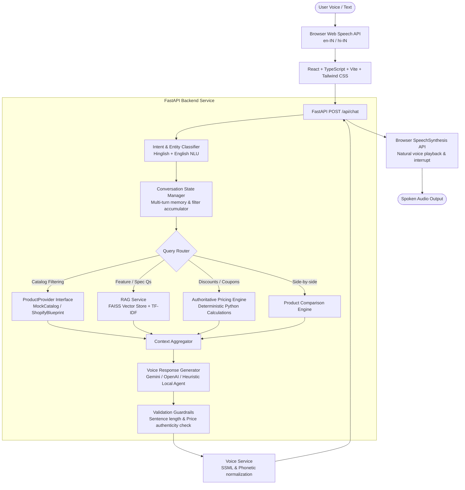

# VaaniCart AI (वाणीकार्ट)
> **"Your AI Shopping Assistant — Just Ask."**

A production-quality full-stack **AI Voice Shopping Assistant** built for modern Indian e-commerce. VaaniCart AI enables voice-first shopping experiences in natural English and Hinglish, combining browser Speech-to-Text (STT), deterministic backend pricing computation, FAISS vector store RAG for product catalogs, guardrail validation, and euphonic Text-to-Speech (TTS).

---

## 1. System Architecture



---

## 2. Core Capabilities & Highlights

1. **True Voice-First Interaction**:
   - Central animated microphone button with real-time states: `IDLE`, `LISTENING`, `PROCESSING`, `SPEAKING`, `ERROR`.
   - Live streaming speech transcript with interim results.
   - Immediate audio interruption capability (tapping the mic or clicking "Stop Spoken Audio" halts playback instantly).
2. **Bilingual Hinglish & English Support**:
   - Understands native Indian shopping expressions: *"Running shoes dikhao under 3000"*, *"Mujhe black sneakers chahiye"*, *"Iska discount kitna hai?"*, *"Ye shoes size 9 mein available hai kya?"*, *"Budget 2500 hai, kuch achha suggest karo"*.
   - Never forces robotic translation into formal English.
3. **Deterministic Backend Pricing Engine (No LLM Math)**:
   - All discounts, MRP savings, coupons (`VAANI100`, `FESTIVE20`, `WELCOME50`), and GST calculations are strictly computed in Python backend logic.
   - LLMs receive verified calculations and are forbidden from inventing or computing authoritative totals.
4. **FAISS Vector Store RAG Retrieval**:
   - Product catalog specifications, dimensions, materials, and battery life are chunked and indexed into FAISS (`IndexFlatIP`).
   - Answers technical queries (*"Which headphones have noise cancellation?"*, *"Which laptop has the best battery life?"*) using strictly grounded catalog chunks.
5. **Shopify-Ready Architecture**:
   - Clean `ProductProvider` abstract base class.
   - `MockProductProvider` (in-memory indexed catalog of 42+ products).
   - Documented `ShopifyProductProvider` GraphQL blueprint for swapping in Shopify Storefront API.
6. **Observability & Developer Inspector**:
   - Real-time dev panel inspecting detected intent, extracted entities, pipeline latencies (intent, retrieval, pricing, LLM, validation), RAG sources, and prompt version.
7. **23 Automated Pytest Tests**:
   - Full test suite covering product search, pricing calculation, coupon engine, Hinglish normalization, RAG retrieval, response validation, and multi-turn state.

---

## 3. Tech Stack

- **Frontend**: React 19, TypeScript, Vite, Tailwind CSS v4, Lucide Icons, Web Speech API (STT), SpeechSynthesis API (TTS).
- **Backend**: Python 3.11+, FastAPI, Pydantic v2, Pydantic-Settings, Uvicorn.
- **AI & RAG**: Google Gemini API (`google-generativeai`), OpenAI API, FAISS (`faiss-cpu`), Scikit-Learn.
- **Testing**: Pytest, Asyncio.

---

## 4. Product Catalog

Contains 42+ realistic products across 8 categories with Indian Rupee (₹) pricing, realistic descriptions, sizes, colors, ratings, stock, and tags:
1. **Running Shoes** (Sprint X, Runner Pro Cloud Stride, Pace Aero Reflex, Marathon Elite Carbon, TrailGrip 4X, LiteFlow Slip-On)
2. **Sneakers** (Urban Retro Classic, Shadow Stealth Mid-Top, Chunky Glide, Pulse High Canvas, Solar Wave)
3. **Headphones** (AcousticPro 800 Hybrid ANC, BassMaster Studio 500, SonicAir ANC Earbuds, EchoPulse, AeroBeats Gaming)
4. **Smart Watches** (Chronos Pulse AMOLED, FitTrack Elite GPS, Aura Luxe Metal Mesh, Verve Neo Band, Titanium Explorer)
5. **Backpacks** (TrailBlazer 35L Rucksack, CommuteShield Anti-Theft, Metro Slim Brief-Pack, CampMaster 55L, Campus Canvas)
6. **T-Shirts** (Breeze Supima Cotton, AeroDry Performance, Vintage Heavyweight Graphic, Luxe Pique Polo, Tri-Blend Muscle)
7. **Laptops** (AeroBook Ultra 14 OLED, TitanForge 15 Gaming RTX 4060, Nova Air 13, IdeaPro 15, FlexBook 360 2-in-1)
8. **Mobile Accessories** (MagGrip 10k PowerBank, 65W GaN III Fast Charger, ArmorFlex 100W Cable, AutoGrip Car Mount, GripShield Case, 7-in-1 USB-C Hub)

---

## 5. Setup & Local Development

### Prerequisites
- Node.js v18+ & npm
- Python 3.11+

### Backend Setup

```bash
cd backend

# Create or activate virtual environment (optional)
# py -3.11 -m venv venv
# .\venv\Scripts\Activate.ps1

# Install dependencies
py -3.11 -m pip install -r requirements.txt

# Configure environment variables
copy .env.example .env

# Run FastAPI backend server
$env:PYTHONPATH="."
py -3.11 -m uvicorn app.main:app --host 127.0.0.1 --port 8000 --reload
```

Backend will be live at `http://127.0.0.1:8000`
- Interactive OpenAPI Docs: `http://127.0.0.1:8000/docs`
- Health check: `http://127.0.0.1:8000/health`

### Frontend Setup

```bash
cd frontend

# Install dependencies
npm install

# Run Vite dev server
npm run dev -- --host 127.0.0.1 --port 5173
```

Frontend will be live at `http://127.0.0.1:5173`

---

## 6. Environment Variables (`.env`)

| Variable | Default | Description |
|---|---|---|
| `APP_NAME` | `VaaniCart AI` | Application branding name |
| `PORT` | `8000` | FastAPI server port |
| `LLM_PROVIDER` | `gemini` | `gemini`, `openai`, or `local` (intelligent local fallback) |
| `GEMINI_API_KEY` | `""` | Google Gemini API Key (optional; local agent runs if empty) |
| `GEMINI_MODEL` | `gemini-1.5-flash` | Gemini model identifier |
| `OPENAI_API_KEY` | `""` | OpenAI API Key (optional) |
| `OPENAI_MODEL` | `gpt-4o-mini` | OpenAI model identifier |
| `PROMPT_VERSION_VOICE`| `v1` | Active voice prompt version (`v1` or `v2`) |
| `PRODUCT_PROVIDER` | `mock` | Catalog provider (`mock` or `shopify`) |
| `SHOPIFY_STORE_DOMAIN` | `""` | Shopify store domain for production transition |
| `SHOPIFY_STOREFRONT_ACCESS_TOKEN` | `""` | Shopify Storefront API token |

---

## 7. REST API Reference

| Method | Endpoint | Description |
|---|---|---|
| `GET` | `/health` | Server status, catalog count, and FAISS index readiness |
| `GET` | `/api/products` | List catalog products with pagination & category filter |
| `GET` | `/api/products/{id}` | Get single product specifications and inventory |
| `POST` | `/api/products/search` | Multi-facet catalog search (price, rating, size, color) |
| `POST` | `/api/chat` | End-to-end voice shopping pipeline (STT $\rightarrow$ NLU $\rightarrow$ RAG $\rightarrow$ Pricing $\rightarrow$ TTS) |
| `POST` | `/api/calculate-price` | Deterministic pricing with coupon code validation |
| `POST` | `/api/compare` | Side-by-side product comparison matrix and spoken summary |
| `POST` | `/api/recommend` | Top-rated recommendations |
| `POST` | `/api/rag/query` | Direct semantic RAG retrieval on product specifications |
| `POST` | `/api/conversation` | Create or fetch multi-turn conversation session |
| `GET` | `/api/conversation/{id}`| Retrieve conversation history and active filter state |

---

## 8. Deterministic Pricing & Coupons

The backend engine strictly calculates:
- Unit Discount: `MRP - Base Price`
- Unit Discount %: `round((Discount / MRP) * 100)`
- Active Coupons:
  - `VAANI100`: Flat ₹100 OFF on orders $\ge$ ₹999.
  - `FESTIVE20`: 20% OFF up to ₹500 on orders $\ge$ ₹1,499.
  - `WELCOME50`: Flat ₹50 OFF on orders $\ge$ ₹499.
- 18% GST estimate component.
- Final net payable amount.

---

## 9. Running Automated Tests

Run the complete 23-test suite:

```bash
cd backend
$env:PYTHONPATH="."
py -3.11 -m pytest tests -v
```

All 23 tests pass:
- `test_product_search.py`: Category, max price, color, size, and ID lookup.
- `test_pricing_engine.py`: Base calculation, quantities, flat coupons, percentage coupons, minimum order thresholds.
- `test_intent_and_language.py`: Hinglish detection, price extraction, size extraction, color extraction, intent classification.
- `test_rag_and_validation.py`: Noise cancellation search, battery life search, sentence count truncation, markdown list scrubbing.
- `test_conversation_flow.py`: Multi-turn conversational context retention, pronoun resolution, and voice formatting.

---

## 10. Manual Voice AI Test Checklist

| # | Test Scenario | Spoken Input | Expected Behavior |
|---|---|---|---|
| 1 | English query | *"Show me running shoes under 3000"* | Returns filtered running shoes $\le$ ₹3,000; speaks top 2 options. |
| 2 | Hinglish query | *"Mujhe 3000 ke andar running shoes chahiye"* | Detects category & price constraint without forced translation. |
| 3 | Price query | *"Sprint X ka price kitna hai?"* | Spoken response quotes verified price ₹2,499. |
| 4 | Discount query | *"Iska discount kitna hai?"* | Retains context product, explains 37% discount from ₹3,999. |
| 5 | Product comparison | *"Compare Sprint X and Runner Pro"* | Opens side-by-side comparison modal and speaks price trade-off. |
| 6 | Recommendation | *"Budget 2500 hai, kuch achha suggest karo"* | Filters products $\le$ ₹2,500 with rating $\ge$ 4.4. |
| 7 | Availability check | *"Ye shoes size 9 mein available hai kya?"* | Checks size array of current product, confirms in-stock status. |
| 8 | Complex RAG query | *"Which headphones have noise cancellation?"* | FAISS semantic search retrieves AcousticPro 800 (-40dB ANC). |
| 9 | Multi-turn follow-up | 1. *"Mujhe sneakers chahiye"*<br/>2. *"Under 2500"* | Merges category filter from Turn 1 with budget from Turn 2. |
| 10 | Voice interruption | Tap microphone while TTS is speaking | SpeechSynthesis halts immediately and re-opens microphone. |

---

## 11. Shopify Migration Guide

To connect a live Shopify store:
1. Open `backend/app/services/providers/shopify_provider.py`.
2. Configure credentials in `.env`:
   ```env
   PRODUCT_PROVIDER=shopify
   SHOPIFY_STORE_DOMAIN=your-store.myshopify.com
   SHOPIFY_STOREFRONT_ACCESS_TOKEN=shpat_xxxxxxxx
   ```
3. The `ProductProvider` interface ensures zero changes to the LLM agent, NLU, or pricing engine.
